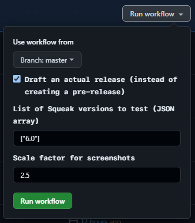

# Squeak by Example

[](https://github.com/hpi-swa-lab/SqueakByExample-english/actions/workflows/build.yml)
[](https://github.com/hpi-swa-lab/SqueakByExample-english/releases/latest)
[](https://github.com/hpi-swa-lab/SqueakByExample-english/releases)

Squeak is a modern, open-source development environment for the Smalltalk programming language promoting a vision of an environment where everything is an object and anything can at run-time.

_Squeak by Example_, intended for both students and developers, will guide you through the Smalltalk language and the Squeak environment by means of a series of examples and exercises. The book helps you getting started with an initial tour of the environment before introducing the details of the language, the standard library, the tools, and the Morphic framework.

# Repository structure

The main file is SBE.tex.  Chapters are in subdirectories.
You can latex either the entire book, or each individual chapter.
Each chapter file starts and ends with the same incantation
which will optionally include macros or end the document if it is
latexed individually.

Use the \ct{} macro for in-line code.
Use the {method} {classdef} {example} and {script} environments for
multi-line code.

If you add a new chapter:
-	please be sure to include it from SBE.tex.
-	Remember to include its /figures/ subdirectory in the graphicspath,
	   which is set in the preamble to SBE.tex.  Don't forget the trailing /
-	Please make sure the chapter compiles with latex both from the main book
	and as a separate chapter.

IMPORTANT: Please check out a fresh copy of the book and compile the book
to verify that you have added all the dependent files (e.g., figures).

## Build process

The PDF of the book is built via GitHub Actions on each commit, which includes the execution of internal tests, the check of TEX-inlined `@TEST` assertions, and the generation of screenshots that are described by figure scripts.
Two PDFs are created, one for the latest Squeak release and one for the current Trunk version.

You can download the latest version of the book from the [Releases page](https://github.com/hpi-swa-lab/SqueakByExample-english/releases).

The usual workflow to **add a scripted screenshot to the book** is as follows:

1. Open the relevant `.tex` file and insert the following snipped before the `\figure` definition:

   ```tex
   \begin{ExecuteSmalltalkScript}
   SBEScreenshotRecorder writeTo: './figures/<name>.png' building: [:helper |
   	self shouldBeImplemented
   ]
   \end{ExecuteSmalltalkScript}
   
   \begin{figure}
      \centering
      \includegraphics[scale=0.65]{<name>}
      \caption{<caption>.\label{fig:<name>}}
   \end{figure}
   ```

2. Insert figure name, caption, and script generation logic in the template above.
   Browse the repository to find existing examples.

   **Tip:** You can also use `SBEDebuggingScreenshotRecorder` instead of `SBEFigureBuilder` for testing your screenshot script right in the image (the file won't be saved on disk in this case).

3. Test your script by doing `SBEFigureBuilder buildAllTexFigures` (maybe you need to set `#resourceDirectory` before) or `SBEFigureBuilder buildFiguresWith: FSPath * 'your' / 'path'`.

4. Build the PDF using the Makefile to make sure your screenshot looks well.

5. Commit! 🚀 The PDF will automatically be built on the CI now ...

6. If the build process has completed, you can watch the results [in the Actions tab of the GitHub repository](https://github.com/hpi-swa-lab/SqueakByExample-english/actions?query=branch%3Amaster) by opening the latest successful build and scrolling down to the artifacts.

**To build the PDF manually,** do the following:

### I. Installation

1. [Get a support Squeak image](https://squeak.org/downloads/) (either the latest release or the latest Trunk image)

2. Open the Git Browser and clone this repository. Install missing dependencies as specified in the baseline if necessary.

3. Make sure to set the resource directory to the path of your working copy:

   ```smalltalk
   SBEFigureBuilder resourceDirectory: FileDirectory default asFSReference / 'path' / 'to' / 'workingCopy'.
   ```

4. Install any Linux distribution.

### II. Building

1. Do it:

   ```smalltalk
   SBEFigureBuilder buildAllTexFigures.
   ```

2. From the shell, run "make" in the working copy.

For more insights into the build process, have a look at the [`Makefile`](/Makefile) and the [`.github/worfklows/build.yml`](.github/workflows/build.yml).

## Printing

The book has been reformatted to 6"x9" (for Lulu). If you want to print any
part of the book, you will find that printing 2 up at 140% works well.

## Release Process

### 1. Actual release

- Make sure the CI is green.
- Check the relevant PDF from the latest prerelase manually for any slips (i.e., search for `missing figure` and `??`, check for layout quirks, maybe scan the build log for warnings).
- Trigger a new release from the <kbd>Actions</kbd> tab of the GitHub repository and update the settings:

  
  
  - Tick the `Draft` checkbox.
  - Specify the Squeak version for the intended edition only (e.g., `["6.0"]`).
  - Increase the scale factor to `10` at will.

  Wait for the CI workflow to complete (might take 10 - 20 minutes depending on the scale factor) and recheck the PDF to be sure (esp. for a different scale factor, some figures could look different).

- Update the sources in the SqueakSource repository (see [SmalltalkSources](#smalltalk-sources)).
- Select the draft release from the <kbd>Releases</kbd> section on GitHub, edit it, and publish it.
- Publish the PDF using Lulu or whatever else (maybe we should document this process here as well).
- Announce the new release on the mailing list, squeak.org, etc.

### 2. Prepare the repository for the next edition

- Secure the current state of the book in a new release branch (e.g., `release/6.0`).
- Replace the old version with the new version in the CI scripts.
- Drop support for the old edition from the default branch:
  - Search the tex sources for all occurrences of `\SqVersionSwitch` and replace them with the argument for the latest version.
  - Search the Smalltalk sources (`*.{st,cs}`) for version switches (`(>=|<=) Squeak`) and replace them with the latest version.
  - To be sure, search the entire book for mentions of the old Squeak version.
- Update the copyright notice.

---

# Style Rules

* Captions of all material is terminated with a period.
* No title case in headings
* In unnamed code snippets: If the expression is followed by the result (-->) there is no period, otherwise add a period.


---

# Testing

Tests are automatically generated from the LaTeX sources.

Grab a recent Squeak image and move it to the folder Squeak book folder.  Do *not* use a 1-click image, since the actual image should be located at the same level as the SBE.tex file.

To run the tests, load the package SBE-Testing from this repository.
Then evaluate the following expression in a workspace:

 ```smalltalk
SBEmain new runTests
 ```

This will automatically extract and run the tests in the LaTeX sources of the Squeak by Example book.  It will also load the hands-on exercises, and check that they are working. (Some tests may also be included from the dependent hands-on packages.)

This will parse (using Regex) the SBE.tex to locate the included chapter files, parse each chapter file to search for @TEST annotations, generate test case classes for each chapter with tests in a new category SBE-GeneratedTests, and generate a test method (numbered by the line number in the chapter) for each test found.  (NB: Any old generated tests are removed before new ones are generated.) Finally, by sending "runTests", a TestRunner is opened on the new category, and all those tests are run.

## How to write tests in LaTeX

A sample test in the BasicClasses looks like this:
 ```latex
\begin{code}{@TEST}
a1 := { { 'harry' } } .
a2 := a1 shallowCopy.
(a1 at: 1) at: 1 put: 'sally'.
(a2 at: 1) at: 1 --> 'sally'
\end{code}
 ```

The "print it" invocation (-->) will generate an assertion.

The generated source code looks like this:

 ```smalltalk
test204
	a1 := { { 'harry' } } .
	a2 := a1 shallowCopy.
	(a1 at: 1) at: 1 put: 'sally'.
	self assert: [ (a2 at: 1) at: 1  ] value printString = '''sally'''
 ```

You may also silently declare or initialize variables immediately after @TEST,
and you may now place comments after the test string:

 ```latex
\begin{code}{@TEST |a b|}
a := b := 'hello'.
a == b --> true "two variables but one object"
\end{code}
 ```

The generated TestCase subclass is `SBEBasicClassesTestCase`.

The generated tests can be removed by evaluating `SBEmain removeOldTestCategory`. This is done automatically whenever you do `SBEmain new runTests`.

---

# LaTeX version

Please use at least texlive 2017.
http://www.tug.org/texlive/

## Figures and OmniGraffle files

Please be sure to use Lucida Sans, not Helvetica, or you may have problems
uploading the PDF to Lulu.  See the font embedding FAQ on lulu.com
See more detailed instructions in Cover/README.txt

## Style files

To inform latex about the location of local style files, set the following environment variable (tcsh):

	setenv TEXINPUTS ./local//:../local//:
		or (bash):
	export TEXINPUTS=./local//:../local//:

If you are using a GUI like TeXshop, you must set the environment variable in ~/.MacOSX/environment.plist :

	<?xml version="1.0" encoding="UTF-8"?>
	<!DOCTYPE plist PUBLIC "-//Apple Computer//DTD PLIST 1.0//EN" "http://www.apple.com/DTDs/PropertyList-1.0.dtd">
	<plist version="1.0">
	<dict>
		<key>TEXINPUTS</key>
		<string>./local//:../local//:</string>
	</dict>
	</plist>

NB: You may need to logout and login again after creating or modifying this file.
Note colon at end of TEXINPUTS that means "append current value here"
(eg local has higher priority). Double slash means search recursively.

# Bibliography

The bibliography can be found in the `Bibliography` folder.
When the `make` command is run, the bibliography is automatically built as well.

---

# Smalltalk Sources

The "Squeak by Example" Monticello Repository can be found as a [FileTree](https://github.com/dalehenrich/filetree) repository in the `SmalltalkSources` folder but is best loaded and saved using [Squot](https://github.com/hpi-swa/Squot).

The package `SBE-Testing` includes as dependencies the code for the hands-on chapters.
It will run all the test code in the latex sources and exercise the hands-on code.

All packages that contain examples relevant to the user are also hosted at SqueakSource at <http://www.squeaksource.com/SqueakByExample60/>.
Before releasing a new edition of the book, make sure to update these sources using the `SBESqueaksource` class from the `SBE-Extract` package.
The SqueakSource repository is world-readable and can be written by the administrators, which are currently ct and pre.

# Coding Style Guide

* An empty line before the first line of the code
* Point at the end of a line, except for a line with a return statement
* Space around all binary selectors
* Keyword message with more than one keyword are broken up on several lines
* Use cascades whenever possible (except for very early introductory examples)
* Avoid unnecessary parentheses

---

# License

This work is licensed under Creative Commons Attribution-ShareAlike 3.0 Unported
	<http://creativecommons.org/licenses/by-sa/3.0/>

You are free:

- to Share -- to copy, distribute and transmit the work
- to Remix -- to adapt the work

Under the following conditions:

Attribution. You must attribute the work in the manner specified by the author or
licensor (but not in any way that suggests that they endorse you or your use of the work).
Share Alike. If you alter, transform, or build upon this work, you may distribute
the resulting work only under the same, similar or a compatible license.
For any reuse or distribution, you must make clear to others the license terms of
this work. The best way to do this is with a link to this web page.
Any of the above conditions can be waived if you get permission from the copyright holder.
Nothing in this license impairs or restricts the author's moral rights.

## Disclaimer
Your fair dealing and other rights are in no way affected by the above.
This is a human-readable summary of the Legal Code (the full license).
